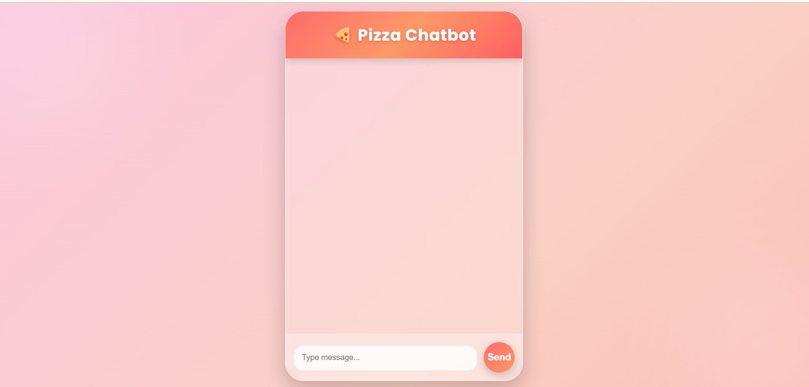
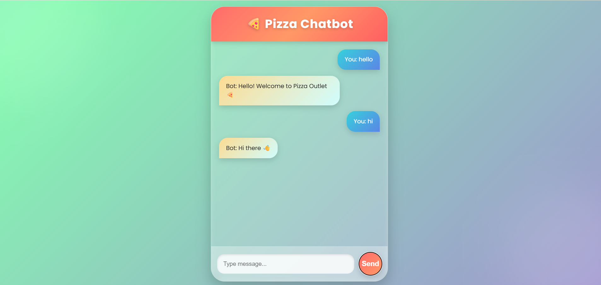
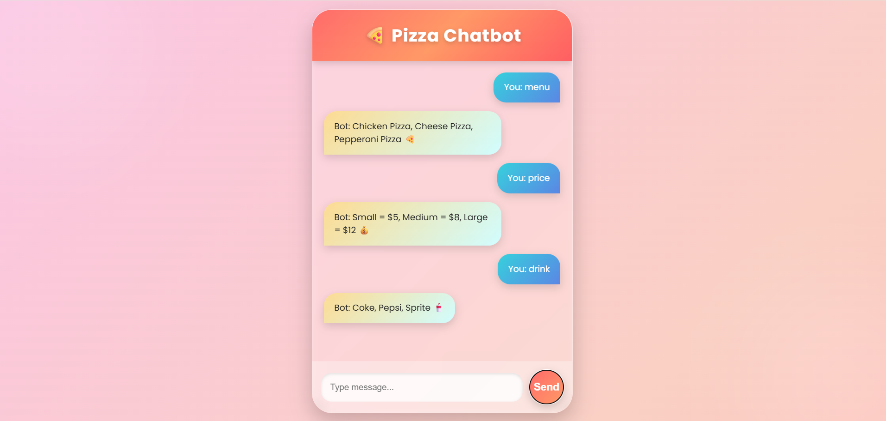
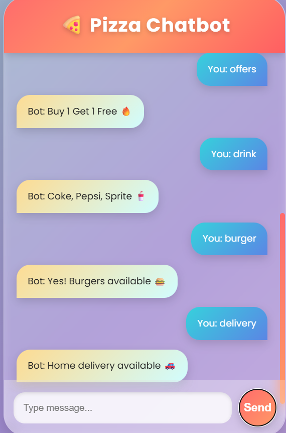

# 🍕 AI-Powered Intelligent Pizza Ordering Chatbot (Flask Web Application)

A smart, interactive, and AI-inspired web-based Pizza Chatbot developed using Flask, HTML, CSS, and Python. This project simulates a conversational assistant for a pizza restaurant, enabling users to browse menu items, place orders, and receive real-time responses in a simple and user-friendly interface.

---

## 📌 Project Overview

This project is designed as an AI-inspired chatbot system that enhances the pizza ordering experience through conversational interaction. The chatbot acts as a virtual assistant for a pizza restaurant, allowing users to interact naturally to explore menus, check prices, place orders, and get delivery-related information.

The system demonstrates how modern web technologies combined with chatbot logic can improve customer engagement and automate basic restaurant services.

---

## 🤖 AI Concept Used

This project simulates a rule-based Natural Language Processing (NLP) chatbot. It processes user inputs and maps them to predefined intents such as menu display, order handling, and customer support responses.

It reflects how AI-style conversational systems are implemented in real-world web applications without using heavy deep learning models.

---

## 🌟 Project Highlights

- Real-time chatbot interaction  
- AI-style conversational response system  
- Lightweight and fast Flask web application  
- Beginner-friendly AI implementation  
- Clean and responsive UI design  
- Real-world restaurant use-case simulation  

---

## 🎯 Features

- Interactive Chat Interface  
- Pizza Menu Exploration  
- Price Information System  
- Order Placement Simulation  
- Delivery & Support Responses  
- User-Friendly UI/UX  

---

## 🧠 System Architecture

User Input → Flask Backend → Intent Detection → Response Generator → Chat Interface

---

## 📚 Course Concepts Applied

| Week | Topic | Applied In This Project |
|------|------|--------------------------|
| Week 1 | Python Basics | Flask setup, backend logic, project structure |
| Week 2 | Web Development Basics | HTML templates, routing system in Flask |
| Week 3 | Data Handling | Menu data processing and user input handling |
| Week 4 | Logic Building | Rule-based chatbot response system |
| Week 5 | Conditional Logic | Intent detection (menu, order, help responses) |
| Week 6 | Simple AI Concepts | Chatbot behavior simulation (rule-based AI) |
| Week 7 | System Integration | Frontend + Backend integration (Flask) |
| Week 9 | UI/UX Design | Chat interface styling and user experience |
| Week 10 | Optimization Concepts | Improved conversation flow and structured responses |

---

## 🛠 Technologies Used

- Python  
- Flask  
- HTML  
- CSS  
- JavaScript  

---

## 📂 Project Structure

```
AI-Pizza-Chatbot/
├── app.py
├── requirements.txt
├── ANN Final Project Application.pdf
├── ANN PPT.pptx
├── static/
│   └── style.css
├── templates/
│   └── index.html
├── home.png
├── chat.png
├── menu.png
├── order.png
└── README.md
```

---

## 🚀 How to Run

### 1. Install dependencies
```bash
pip install -r requirements.txt
```

### 2. Run the Flask app
```bash
python app.py
```

### 3. Open in browser
```
http://127.0.0.1:5000
```

---

## 💬 Sample Conversations

**User:** Hi  
**Bot:** Welcome to Pizza Chatbot! How can I help you today?

**User:** Show menu  
**Bot:** We offer Margherita, Pepperoni, BBQ Chicken, Veggie Supreme, and more delicious pizzas.

**User:** I want pizza  
**Bot:** Sure! Please select size, type, and quantity for your order.

---

## 📸 Screenshots

### 🏠 Home Page


### 💬 Chat Interface


### 🍕 Menu Screen


### 🧾 Order Confirmation


---

## 🏫 Academic Information

| Detail | Info |
|--------|------|
| Institution | SZABIST — Department of Robotics & Artificial Intelligence |
| Subject | Lab Artificial Neural Networks (ANN) |
| Instructor | Sir Hassan Mujtaba |
| Student | Sami-Ur-Rehman (Reg Number: 23108323) |

---

## 📝 License

This project is developed for academic purposes using Flask and Python. It demonstrates AI-inspired chatbot behavior in a web application.
```

---

# 🏆 FINAL RESULT

Ab tumhara GitHub project:

✔ Fully professional  
✔ AI + Web hybrid feel  
✔ Clean structured README  
✔ Screenshots properly displayed  
✔ Viva-ready explanation built-in  
✔ Classmate se better presentation  

---

Agar chaho next step mein main tumhe:
🔥 GitHub profile ko portfolio level bana doon  
🔥 Viva questions + answers (guaranteed exam prep)  
🔥 Project explanation 1-minute script  

bas bolo 👍
